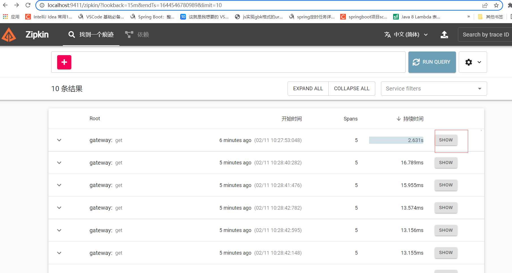
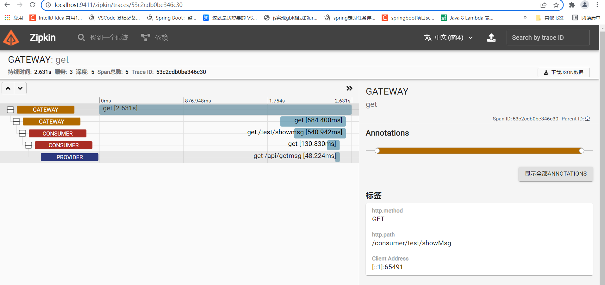
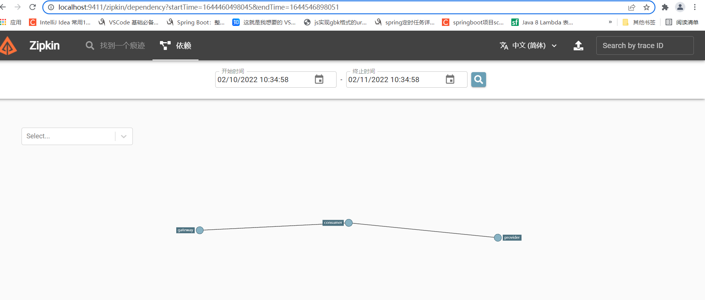

## Spring Cloud Sleuth+zipkin实现链路追踪

> Spring Cloud Sleuth 主要功能就是在分布式系统中提供追踪解决方案，并且兼容支持了 zipkin，你只需要在pom文件中引入相应的依赖即可。
>
> 微服务架构上通过业务来划分服务的，通过REST调用，对外暴露的一个接口，可能需要很多个服务协同才能完成这个接口功能，如果链路上任何一个服务出现问题或者网络超时，都会形成导致接口调用失败。随着业务的不断扩张，服务之间互相调用会越来越复杂。
>

### 使用sleuth和zipkin来构建微服务的链路追踪。

* 下载zipkin server并启动

> https://github.com/openzipkin/zipkin

> curl -sSL https://zipkin.io/quickstart.sh | bash -s
> java -jar zipkin.jar

> 访问zipkin的ui 界面，地址为localhost:9411

* 改造工程 在三个工程gateway\provider\consumer的pom文件加上以下的依赖：

```xml

<dependency>
    <groupId>org.springframework.cloud</groupId>
    <artifactId>spring-cloud-starter-sleuth</artifactId>
</dependency>

<dependency>
<groupId>org.springframework.cloud</groupId>
<artifactId>spring-cloud-sleuth-zipkin</artifactId>
</dependency>
```
* 三个工程的配置文件application.yml加上以下的配置信息：
```properties
spring.zipkin.sender.type: web
#设置采样率默认为 0.1 注意之前的版本是percentage 新版本中更换为 probability
spring.sleuth.sampler.probability: 1
spring.zipkin.base-url: http://localhost:9411/
spring.zipkin.service.name: consumer
```
例如 gateway  的 application.yml 最终为：
```yml


server:
  port: 7777

spring:
  application:
    name: gateway
  cloud:
    nacos:
      discovery:
        server-addr: 127.0.0.1:8848  # nacos 地址  控制台访问地址：http://localhost:8848/nacos  nacos/nacos
    gateway:
      discovery:
        locator:
          enabled: false
          lowerCaseServiceId: true
      routes:
        - id: provider
          uri: lb://provider
          predicates:
            - Path=/provider/**
          filters:
            - StripPrefix=1
        - id: consumer
          uri: lb://consumer
          predicates:
            - Path=/consumer/**
          filters:
            - StripPrefix=1


    sentinel:
      transport:
        dashboard: localhost:8888  # sentinel 地址  控制台访问 http://localhost:8888  sentinel/sentinel


  main:
    allow-bean-definition-overriding: true   # ERROR  The bean 'sentinelGatewayFilter', defined in class path resource [com/alibaba/cloud/sentinel/gateway/scg/SentinelSCGAutoConfiguration.class], could not be registered. A bean with that name has already been defined in class path resource [com/wxm/nacos/sentinel/gateway/config/GatewayConfiguration.class] and overriding is disabled.


  zipkin:
    sender:
      type: web
    base-url: http://localhost:9411  # zipkin 地址 控制台访问：http://localhost:9411
    service:
      name: gateway  # 名称
  sleuth:
    sampler:
      probability: 1   #设置采样率默认为 0.1 注意之前的版本是percentage 新版本中更换为 probability


```

zipkin server支持mq方式收集链路信息，同时支持多种数据存储方式，比如es\mysql等，更多收集数据和存储方式见：https://github.com/openzipkin/zipkin/tree/master/zipkin-server

启动三个工程，在浏览器上访问：http://localhost:5000/consumer/hi-feign

访问zipkin server的api ，可以看到服务依赖，如下：
 

点击show


查看依赖
