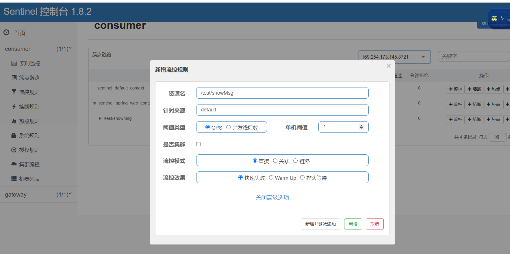
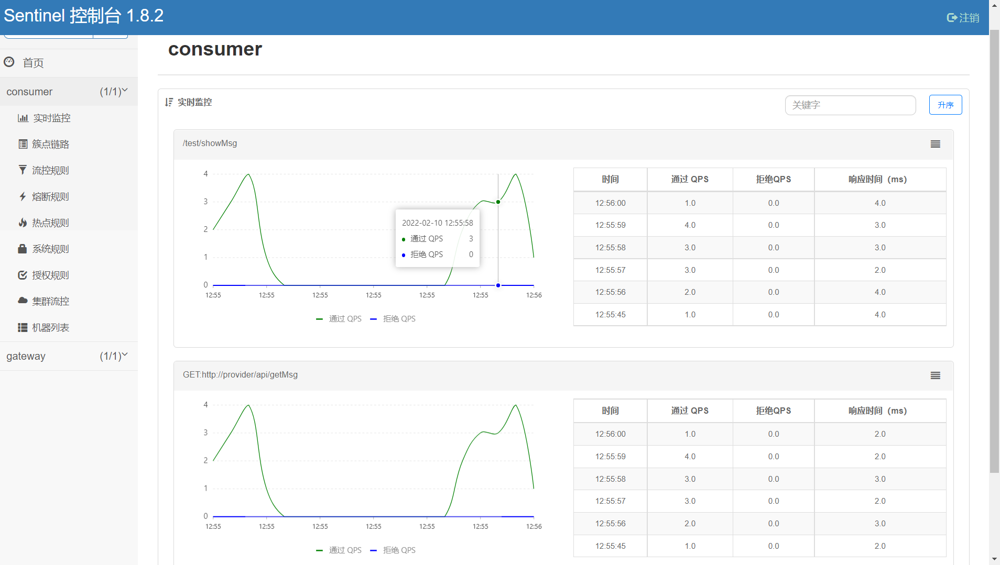
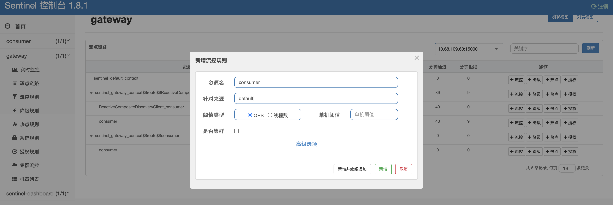

## 使用sentinel作为熔断器

* 什么是sentinel

> Sentinel，中文翻译为哨兵，是为微服务提供流量控制、熔断降级的功能，它和Hystrix提供的功能一样，可以有效的解决微服务调用产生的“雪崩”效应，为微服务系统提供了稳定性的解决方案。随着Hytrxi进入了维护期，不再提供新功能，Sentinel是一个不错的替代方案。通常情况，Hystrix采用线程池对服务的调用进行隔离，Sentinel才用了用户线程对接口进行隔离，二者相比，Hystrxi是服务级别的隔离，Sentinel提供了接口级别的隔离，Sentinel隔离级别更加精细，另外Sentinel直接使用用户线程进行限制，相比Hystrix的线程池隔离，减少了线程切换的开销。另外Sentinel的DashBoard提供了在线更改限流规则的配置，也更加的优化。

从官方文档的介绍，Sentinel 具有以下特征:

1. 丰富的应用场景： Sentinel 承接了阿里巴巴近 10 年的双十一大促流量的核心场景，例如秒杀（即突发流量控制在系统容量可以承受的范围）、消息削峰填谷、实时熔断下游不可用应用等。
2. 完备的实时监控： Sentinel 同时提供实时的监控功能。您可以在控制台中看到接入应用的单台机器秒级数据，甚至 500 台以下规模的集群的汇总运行情况。
3. 广泛的开源生态： Sentinel 提供开箱即用的与其它开源框架/库的整合模块，例如与 Spring Cloud、Dubbo、gRPC 的整合。您只需要引入相应的依赖并进行简单的配置即可快速地接入 Sentinel。
4. 完善的 SPI 扩展点： Sentinel 提供简单易用、完善的 SPI 扩展点。您可以通过实现扩展点，快速的定制逻辑。例如定制规则管理、适配数据源等。

* 下载sentinel dashboard

> Sentinel dashboard提供一个轻量级的控制台，它提供机器发现、单机资源实时监控、集群资源汇总，以及规则管理的功能。您只需要对应用进行简单的配置，就可以使用这些功能。
>
> 注意: 集群资源汇总仅支持 500 台以下的应用集群，有大概 1 - 2 秒的延时。

下载最新的sentinel
dashboard，下载地址为[https://github.com/alibaba/Sentinel/releases](https://github.com/alibaba/Sentinel/releases)

* 启动

```shell
# windows
java  -Dserver.port=8888 -Dcsp.sentinel.dashboard.server=localhost:8808 -Dproject.name=sentinel-dashboard  -jar sentinel-dashboard-1.8.2.jar
# linux
# nohup  java  -Dserver.port=8888 -Dcsp.sentinel.dashboard.server=localhost:8808 -Dproject.name=sentinel-dashboard  -jar sentinel-dashboard-1.8.2.jar  &

# -Dserver.port=8080 用于指定 Sentinel 控制台端口为 8080
# -Dcsp.sentinel.dashboard.server 用于控制台对外暴露的服务地址

# 从 Sentinel 1.6.0 起，Sentinel 控制台引入基本的登录功能，默认用户名和密码都是 sentinel。
# 如果需要自行配置，可以通过如下参数进行调整：
# -Dsentinel.dashboard.auth.username=sentinel 用于指定控制台的登录用户名为 sentinel；
# -Dsentinel.dashboard.auth.password=123456 用于指定控制台的登录密码为 123456；如果省略这两个参数，默认用户和密码均为 sentinel；
# -Dserver.servlet.session.timeout=7200 用于指定 Spring Boot 服务端 session 的过期时间，如 7200 表示 7200 秒；60m 表示 60 分钟，默认为 30 分钟；

# 控制台启动后，访问 localhost:8888，可以查看控制台。
 ```

### 项目改造

> 在上一个项目（spring-cloud-nacos-gateway）基础上改造

* 改造consumer
1. 在consumer的pom文件加上spring cloud sentinel的依赖，如下：

```xml

<dependency>
    <groupId>com.alibaba.cloud</groupId>
    <artifactId>spring-cloud-starter-alibaba-sentinel</artifactId>
</dependency>
```
2. 配置文件application.yml
```yml

server:
  port: 7774

spring:
  application:
    name: consumer


  cloud:
    nacos:
      discovery:
        server-addr: localhost:8848

    sentinel:
      transport:
        dashboard: localhost:8888  # 配置sentinel的dashboard的地址

feign:
  sentinel:
    enabled: true  # 通过feign.sentinel.enable开启Feign和sentinel的自动适配
```
> 通过feign.sentinel.enable开启Feign和sentinel的自动适配。配置sentinel的dashboard的地址。
通过这样简单的配置，Feign和sentinel就配置好了。

* 启动三个工程gateway\provider\consumer
* 浏览器多次访问：http://localhost:7777/consumer/test/showMsg
* 登录sentinel: http://localhost:8888/  用户名sentinel 密码 sentinel
> 为 test/showMsg 见一个

> 
> qps为1，快速访问http://localhost:7777/consumer/test/showMsg，会有失败的情况。
> 


### 在 spring cloud gateway 上使用sentinel
1. Spring cloud gateway已经适配了sentinel，在gatewayg工程的pom文件加上相关依赖：
```xml
        <!--Spring cloud gateway已经适配了sentinel，在gatewayg工程的pom文件加上相关依赖：-->

        <dependency>
            <groupId>com.alibaba.cloud</groupId>
            <artifactId>spring-cloud-starter-alibaba-sentinel</artifactId>
        </dependency>

        <dependency>
            <groupId>com.alibaba.cloud</groupId>
            <artifactId>spring-cloud-alibaba-sentinel-gateway</artifactId>
        </dependency>
```
2. 在配置文件application.yml上加上sentinel dashboard的配置：
```yml


server:
  port: 7777

spring:
  application:
    name: gateway
  cloud:
    nacos:
      discovery:
        server-addr: 127.0.0.1:8848
    gateway:
      discovery:
        locator:
          enabled: false
          lowerCaseServiceId: true
      routes:
        - id: provider
          uri: lb://provider
          predicates:
            - Path=/provider/**
          filters:
            - StripPrefix=1
        - id: consumer
          uri: lb://consumer
          predicates:
            - Path=/consumer/**
          filters:
            - StripPrefix=1


    sentinel:
      transport:
        dashboard: localhost:8888

# ERROR
 #The bean 'sentinelGatewayFilter', defined in class path resource [com/alibaba/cloud/sentinel/gateway/scg/SentinelSCGAutoConfiguration.class], could not be registered. A bean with that name has already been defined in class path resource [com/wxm/nacos/sentinel/gateway/config/GatewayConfiguration.class] and overriding is disabled.
  main:
    allow-bean-definition-overriding: true
```

3.创建一个网关分组和网关的限流规则，代码如下，参考https://github.com/alibaba/Sentinel/wiki/%E7%BD%91%E5%85%B3%E9%99%90%E6%B5%81
```java

import com.alibaba.csp.sentinel.adapter.gateway.common.SentinelGatewayConstants;
import com.alibaba.csp.sentinel.adapter.gateway.common.api.ApiDefinition;
import com.alibaba.csp.sentinel.adapter.gateway.common.api.ApiPathPredicateItem;
import com.alibaba.csp.sentinel.adapter.gateway.common.api.ApiPredicateItem;
import com.alibaba.csp.sentinel.adapter.gateway.common.api.GatewayApiDefinitionManager;
import com.alibaba.csp.sentinel.adapter.gateway.common.rule.GatewayFlowRule;
import com.alibaba.csp.sentinel.adapter.gateway.common.rule.GatewayParamFlowItem;
import com.alibaba.csp.sentinel.adapter.gateway.common.rule.GatewayRuleManager;
import com.alibaba.csp.sentinel.adapter.gateway.sc.SentinelGatewayFilter;
import com.alibaba.csp.sentinel.adapter.gateway.sc.callback.GatewayCallbackManager;
import com.alibaba.csp.sentinel.adapter.gateway.sc.exception.SentinelGatewayBlockExceptionHandler;
import com.alibaba.csp.sentinel.slots.block.RuleConstant;
import com.wxm.nacos.sentinel.gateway.handler.MyBlockRequestHandler;
import org.springframework.beans.factory.ObjectProvider;
import org.springframework.cloud.gateway.filter.GlobalFilter;
import org.springframework.context.annotation.Bean;
import org.springframework.context.annotation.Configuration;
import org.springframework.core.Ordered;
import org.springframework.core.annotation.Order;
import org.springframework.http.codec.ServerCodecConfigurer;
import org.springframework.web.reactive.result.view.ViewResolver;

import javax.annotation.PostConstruct;
import java.util.Collections;
import java.util.HashSet;
import java.util.List;
import java.util.Set;

/**
 * <p>注入Sentinel配置</p>
 * <p>我们写一个 @Configuration 配置类（放在Boot的类路径同级或者子级），里面的代码主要作用是设置需要限流的API （根据路径），以及限流的规则</p>
 *
 * @author 王森明
 * @date 2021/11/1 16:36
 * @since 1.0.0
 */
@Configuration
public class GatewayConfiguration {


    private final List<ViewResolver> viewResolvers;
    private final ServerCodecConfigurer serverCodecConfigurer;

    public GatewayConfiguration(ObjectProvider<List<ViewResolver>> viewResolversProvider,
                                ServerCodecConfigurer serverCodecConfigurer) {
        this.viewResolvers = viewResolversProvider.getIfAvailable(Collections::emptyList);
        this.serverCodecConfigurer = serverCodecConfigurer;
    }

    @Bean
    @Order(Ordered.HIGHEST_PRECEDENCE)
    public SentinelGatewayBlockExceptionHandler sentinelGatewayBlockExceptionHandler() {
        // Register the block exception handler for Spring Cloud Gateway.
        return new SentinelGatewayBlockExceptionHandler(viewResolvers, serverCodecConfigurer);
    }

    @Bean
    @Order(-1)
    public GlobalFilter sentinelGatewayFilter() {
        return new SentinelGatewayFilter();
    }

    @PostConstruct
    public void doInit() {
        initCustomizedApis();
        initGatewayRules();

       // 在之前的 GatewayConfiguration 中注册一个限流处理器

        GatewayCallbackManager.setBlockHandler(new MyBlockRequestHandler());

    }


    private void initCustomizedApis() {
        /**
            ApiDefinition：用户自定义的 API 定义分组，可以看做是一些 URL 匹配的组合。
            比如我们可以定义一个 API 叫 my_api，请求 path 模式为 /foo/** 和 /baz/** 的都归到 my_api 这个 API 分组下面。
            限流的时候可以针对这个自定义的 API 分组维度进行限流。
        */
        Set<ApiDefinition> definitions = new HashSet<>();
        ApiDefinition apiProvider = new ApiDefinition("combat-gateway-provider-spi")
                .setPredicateItems(new HashSet<ApiPredicateItem>() {{
                    add(new ApiPathPredicateItem().setPattern("/server/**").setMatchStrategy(SentinelGatewayConstants.URL_MATCH_STRATEGY_PREFIX));
                    add(new ApiPathPredicateItem().setPattern("/spi/**").setMatchStrategy(SentinelGatewayConstants.URL_MATCH_STRATEGY_PREFIX));
                    add(new ApiPathPredicateItem().setPattern("/test/**").setMatchStrategy(SentinelGatewayConstants.URL_MATCH_STRATEGY_PREFIX));
                }});

        ApiDefinition apiConsumer = new ApiDefinition("combat-gateway-consumer-api")
                .setPredicateItems(new HashSet<ApiPredicateItem>(){{
                    add(new ApiPathPredicateItem().setPattern("/client/**").setMatchStrategy(SentinelGatewayConstants.URL_MATCH_STRATEGY_PREFIX));
                    add(new ApiPathPredicateItem().setPattern("/api/**").setMatchStrategy(SentinelGatewayConstants.URL_MATCH_STRATEGY_PREFIX));
                    add(new ApiPathPredicateItem().setPattern("/test/**").setMatchStrategy(SentinelGatewayConstants.URL_MATCH_STRATEGY_PREFIX));
                }});

        definitions.add(apiProvider);
        definitions.add(apiConsumer);
        GatewayApiDefinitionManager.loadApiDefinitions(definitions);

    }


    private void initGatewayRules() {
        /**
            GatewayFlowRule：网关限流规则，
            针对 API Gateway 的场景定制的限流规则，可以针对不同 route 或自定义的 API 分组进行限流，
            支持针对请求中的参数、Header、来源 IP 等进行定制化的限流。
        */
        Set<GatewayFlowRule> rules = new HashSet<>();

        /**
         * 设置限流规则
            count: QPS即每秒钟允许的调用次数
             intervalSec: 每隔多少时间统计一次汇总数据，统计时间窗口，单位是秒，默认是 1 秒。
        */
        rules.add(new GatewayFlowRule("combat-gateway-provider")
                .setResourceMode(SentinelGatewayConstants.RESOURCE_MODE_CUSTOM_API_NAME)
                .setCount(5)
                .setIntervalSec(1)
                .setParamItem(new GatewayParamFlowItem().setParseStrategy(SentinelGatewayConstants.PARAM_PARSE_STRATEGY_URL_PARAM).setFieldName("wangsm"))


        );


        rules.add(new GatewayFlowRule("combat-gateway-provider")
                .setCount(10)
                .setIntervalSec(1)
                .setControlBehavior(RuleConstant.CONTROL_BEHAVIOR_RATE_LIMITER)
                .setMaxQueueingTimeoutMs(600)
                .setParamItem(new GatewayParamFlowItem()
                        .setParseStrategy(SentinelGatewayConstants.PARAM_PARSE_STRATEGY_HEADER)
                        .setFieldName("X-Sentinel-Flag")
                )
        );

        rules.add(new GatewayFlowRule("combat-gateway-provider")
                .setCount(1)
                .setIntervalSec(1)
                .setParamItem(new GatewayParamFlowItem()
                        .setParseStrategy(SentinelGatewayConstants.PARAM_PARSE_STRATEGY_URL_PARAM)
                        .setFieldName("pa")
                )
        );
        rules.add(new GatewayFlowRule("combat-gateway-provider")
                .setCount(2)
                .setIntervalSec(30)
                .setParamItem(new GatewayParamFlowItem()
                        .setParseStrategy(SentinelGatewayConstants.PARAM_PARSE_STRATEGY_URL_PARAM)
                        .setFieldName("type")
                        .setPattern("warn")
                        .setMatchStrategy(SentinelGatewayConstants.PARAM_MATCH_STRATEGY_CONTAINS)
                )
        );

        rules.add(new GatewayFlowRule("combat-gateway-provider")
                .setResourceMode(SentinelGatewayConstants.RESOURCE_MODE_CUSTOM_API_NAME)
                .setCount(5)
                .setIntervalSec(1)
                .setParamItem(new GatewayParamFlowItem()
                        .setParseStrategy(SentinelGatewayConstants.PARAM_PARSE_STRATEGY_URL_PARAM)
                        .setFieldName("pn")
                )
        );


        rules.add(new GatewayFlowRule("combat-gateway-consumer")
                .setCount(10)
                .setIntervalSec(1)
        );
        rules.add(new GatewayFlowRule("combat-gateway-consumer")
                .setCount(2)
                .setIntervalSec(2)
                .setBurst(2)
                .setParamItem(new GatewayParamFlowItem()
                        .setParseStrategy(SentinelGatewayConstants.PARAM_PARSE_STRATEGY_CLIENT_IP)
                )
        );


        GatewayRuleManager.loadRules(rules);
    }


    /**
     * 其中网关限流规则 GatewayFlowRule 的字段解释如下：
     *
     * resource：资源名称，可以是网关中的 route 名称或者用户自定义的 API 分组名称。
     * resourceMode：规则是针对 API Gateway 的 route（RESOURCE_MODE_ROUTE_ID）还是用户在 Sentinel 中定义的 API 分组（RESOURCE_MODE_CUSTOM_API_NAME），默认是 route。
     * grade：限流指标维度，同限流规则的 grade 字段。
     * count：限流阈值
     * intervalSec：统计时间窗口，单位是秒，默认是 1 秒。
     * controlBehavior：流量整形的控制效果，同限流规则的 controlBehavior 字段，目前支持快速失败和匀速排队两种模式，默认是快速失败。
     * burst：应对突发请求时额外允许的请求数目。
     * maxQueueingTimeoutMs：匀速排队模式下的最长排队时间，单位是毫秒，仅在匀速排队模式下生效。
     * paramItem：参数限流配置。若不提供，则代表不针对参数进行限流，该网关规则将会被转换成普通流控规则；否则会转换成热点规则。其中的字段：
     * parseStrategy：从请求中提取参数的策略，目前支持提取来源 IP（PARAM_PARSE_STRATEGY_CLIENT_IP）、Host（PARAM_PARSE_STRATEGY_HOST）、任意 Header（PARAM_PARSE_STRATEGY_HEADER）和任意 URL 参数（PARAM_PARSE_STRATEGY_URL_PARAM）四种模式。
     * fieldName：若提取策略选择 Header 模式或 URL 参数模式，则需要指定对应的 header 名称或 URL 参数名称。
     * pattern：参数值的匹配模式，只有匹配该模式的请求属性值会纳入统计和流控；若为空则统计该请求属性的所有值。（1.6.2 版本开始支持）
     * matchStrategy：参数值的匹配策略，目前支持精确匹配（PARAM_MATCH_STRATEGY_EXACT）、子串匹配（PARAM_MATCH_STRATEGY_CONTAINS）和正则匹配（PARAM_MATCH_STRATEGY_REGEX）。（1.6.2 版本开始支持）
     * 用户可以通过 GatewayRuleManager.loadRules(rules) 手动加载网关规则，或通过 GatewayRuleManager.register2Property(property) 注册动态规则源动态推送（推荐方式）。
     * ————————————————
     * 版权声明：本文为CSDN博主「gin90」的原创文章，遵循CC 4.0 BY-SA版权协议，转载请附上原文出处链接及本声明。
     * 原文链接：https://blog.csdn.net/u011177064/article/details/104270027
     */
}

```

4.在sentinel 控制台为gateway创建一个限流规则，如下：



流控规则为qps=1，快速访问