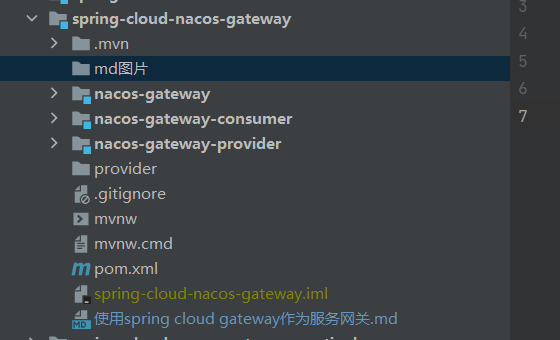

## 使用Spring Cloud gateway 作为服务网关
> Spring Cloud Gateway是Spring Cloud官方推出的第二代网关框架，取代Zuul网关。
> 
>网关作为流量的，在微服务系统中有着非常作用，网关常见的功能有路由转发、权限校验、限流控制等作用。

### 项目结构
* 项目结构


* 父pom.xml 中映主要引入

```xml

<properties>
    <java.version>1.8</java.version>
    <spring-boot.version>2.4.4</spring-boot.version>
    <spring-cloud.version>2020.0.2</spring-cloud.version>
    <spring-cloud-alibaba.version>2020.0.RC1</spring-cloud-alibaba.version>
</properties>

<dependencyManagement>
<dependencies>
    <!-- spring boot 依赖 -->
    <dependency>
        <groupId>org.springframework.boot</groupId>
        <artifactId>spring-boot-dependencies</artifactId>
        <version>${spring-boot.version}</version>
        <type>pom</type>
        <scope>import</scope>
    </dependency>
    <!-- spring cloud 依赖 -->
    <dependency>
        <groupId>org.springframework.cloud</groupId>
        <artifactId>spring-cloud-dependencies</artifactId>
        <version>${spring-cloud.version}</version>
        <type>pom</type>
        <scope>import</scope>
    </dependency>
    <!-- spring cloud alibaba 依赖 -->
    <dependency>
        <groupId>com.alibaba.cloud</groupId>
        <artifactId>spring-cloud-alibaba-dependencies</artifactId>
        <version>${spring-cloud-alibaba.version}</version>
        <type>pom</type>
        <scope>import</scope>
    </dependency>
</dependencies>
</dependencyManagement>

```
* 服务提供者nacos-gateway-provider

1. 在provider的pom文件引入依赖
```xml
    <dependencies>
        <dependency>
            <groupId>org.springframework.boot</groupId>
            <artifactId>spring-boot-starter-web</artifactId>
        </dependency>

        <dependency>
            <groupId>com.alibaba.cloud</groupId>
            <artifactId>spring-cloud-starter-alibaba-nacos-discovery</artifactId>
        </dependency>

        <dependency>
            <groupId>org.springframework.boot</groupId>
            <artifactId>spring-boot-starter-test</artifactId>
            <scope>test</scope>
        </dependency>
    </dependencies>
```
2. 配置文件application.yml

```yml
server:
  port: 7773

spring:
  application:
    name: provider

  cloud:
    nacos:
      discovery:
        server-addr: localhost:8848
```
3. 启动类

> 添加 @EnableDiscoveryClient
>
> @EnableDiscoveryClient和@EnableEurekaClient共同点就是：都是能够让注册中心能够发现，扫描到改服务。

4. 写一个接口
```java
import org.springframework.beans.factory.annotation.Value;
import org.springframework.web.bind.annotation.GetMapping;
import org.springframework.web.bind.annotation.RequestMapping;
import org.springframework.web.bind.annotation.RequestParam;
import org.springframework.web.bind.annotation.RestController;

/**
 * <p></p>
 * <p></p>
 *
 * @author 王森明
 * @date 2021/11/1 15:00
 * @since 1.0.0
 */
@RequestMapping("/provider")
@RestController
public class ProviderController {
    @Value("${server.port}")
    private String serverPort;

    @GetMapping("/getMsg")
    public String getMsg(@RequestParam(value="name",required = false,defaultValue = "王森明")String name){
        return  name+",Welcome! I'm provider,my port is "+serverPort;
    }
}

```

* 服务消费者nacos-gateway-consumer

1. 在pom文件引入以下依赖
```xml
    <dependencies>
        <!--必须引入starter-web才能注册到nacos中去-->
        <dependency>
            <groupId>org.springframework.boot</groupId>
            <artifactId>spring-boot-starter-web</artifactId>
        </dependency>

        <dependency>
            <groupId>com.alibaba.cloud</groupId>
            <artifactId>spring-cloud-starter-alibaba-nacos-discovery</artifactId>
        </dependency>

        <dependency>
            <groupId>org.springframework.cloud</groupId>
            <artifactId>spring-cloud-starter-openfeign</artifactId>
        </dependency>


        <dependency>
            <groupId>org.springframework.cloud</groupId>
            <artifactId>spring-cloud-starter-loadbalancer</artifactId>
        </dependency>

        <dependency>
            <groupId>org.springframework.boot</groupId>
            <artifactId>spring-boot-starter-test</artifactId>
            <scope>test</scope>
        </dependency>
    </dependencies>
```

2. 配置文件application.yml

```yml
server:
  port: 7774

spring:
  application:
    name: consumer


  cloud:
    nacos:
      discovery:
        server-addr: localhost:8848
```

3. 启动类
```java
import org.springframework.boot.SpringApplication;
import org.springframework.boot.autoconfigure.SpringBootApplication;
import org.springframework.cloud.client.discovery.EnableDiscoveryClient;
import org.springframework.cloud.openfeign.EnableFeignClients;

@EnableFeignClients
@EnableDiscoveryClient
@SpringBootApplication
public class NacosGatewayConsumerApplication {

    public static void main(String[] args) {
        SpringApplication.run(NacosGatewayConsumerApplication.class, args);
    }

}
```

4. 写一个FeignClient，去调用provider服务的接口

```java
import org.springframework.cloud.openfeign.FeignClient;
import org.springframework.web.bind.annotation.GetMapping;
import org.springframework.web.bind.annotation.RequestParam;

/**
 * <p></p>
 * <p></p>
 *
 * @author 王森明
 * @date 2021/11/1 15:04
 * @since 1.0.0
 */
@FeignClient(value="provider")
public interface ProviderFeignClient {
    /**
     * 需要对应服务提供者的访问权路径/provider/getMsg
     * @param name
     * @return
     */
    @GetMapping("/provider/getMsg")
    String getMsg(@RequestParam("name")String name);
}

```

5. 写一个接口，让consumer去调用provider服务的接口
```java
import com.wxm.nacos.gateway.consumer.feign.ProviderFeignClient;
import org.springframework.beans.factory.annotation.Autowired;
import org.springframework.beans.factory.annotation.Value;
import org.springframework.web.bind.annotation.GetMapping;
import org.springframework.web.bind.annotation.RequestMapping;
import org.springframework.web.bind.annotation.RequestParam;
import org.springframework.web.bind.annotation.RestController;

/**
 * <p></p>
 * <p></p>
 *
 * @author 王森明
 * @date 2021/11/1 15:03
 * @since 1.0.0
 */
@RestController
@RequestMapping("test")
public class ConsumerController {
    @Value("${server.port}")
    private String serverPort;
    @Autowired
    private ProviderFeignClient providerFeignClient;

    @GetMapping("/showMsg")
    private String getMsg(@RequestParam(value="name",required = false) String name){
        return providerFeignClient.getMsg(name)+", The current access comes from a consumer with port number "+serverPort;
    }
}
```

* 网关 nacos-gateway
1. 在pom.xml中引入一下依赖
```xml
    <dependencies>
        <!--gateway需要注册到nacos中去，需要引入以下的依赖：-->
        <dependency>
            <groupId>com.alibaba.cloud</groupId>
            <artifactId>spring-cloud-starter-alibaba-nacos-discovery</artifactId>
        </dependency>
        <dependency>
            <groupId>org.springframework.cloud</groupId>
            <artifactId>spring-cloud-starter-gateway</artifactId>
        </dependency>

        <dependency>
            <groupId>org.springframework.boot</groupId>
            <artifactId>spring-boot-starter-webflux</artifactId>
        </dependency>

        <dependency>
            <groupId>org.springframework.cloud</groupId>
            <artifactId>spring-cloud-starter-loadbalancer</artifactId>
        </dependency>
        <dependency>
            <groupId>junit</groupId>
            <artifactId>junit</artifactId>
            <scope>test</scope>
        </dependency>
        <dependency>
            <groupId>org.springframework.boot</groupId>
            <artifactId>spring-boot-starter-test</artifactId>
            <scope>test</scope>
        </dependency>
    </dependencies>
```
2. 配置文件application.yml
```yml
  server:
    port: 7777

  spring:
    application:
      name: gateway
    cloud:
      nacos:
        discovery:
          server-addr: 127.0.0.1:8848
      gateway:
        discovery:
          locator:
            enabled: false
            lowerCaseServiceId: true
        routes:
          - id: provider
            uri: lb://provider
            predicates:
              - Path=/provider/**
            filters:
              - StripPrefix=1
          - id: consumer
            uri: lb://consumer
            predicates:
              - Path=/consumer/**
            filters:
              - StripPrefix=1

```
3. 启动类
```java
import org.springframework.boot.SpringApplication;
import org.springframework.boot.autoconfigure.SpringBootApplication;
import org.springframework.cloud.client.discovery.EnableDiscoveryClient;

@EnableDiscoveryClient
@SpringBootApplication
public class NacosGatewayApplication {

    public static void main(String[] args) {
        SpringApplication.run(NacosGatewayApplication.class, args);
    }

}

```

###  启动
> 依次启动gateway\consumer\provider三个工程，在nacos中已经成功注册
> 
> 在浏览器上通过网关访问
> http://localhost:7777/consumer/test/showMsg