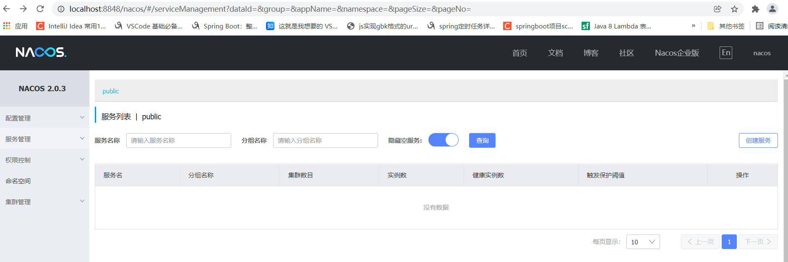
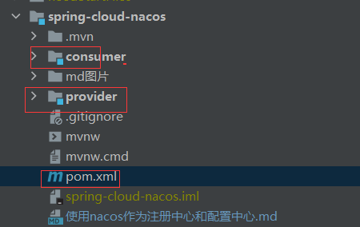
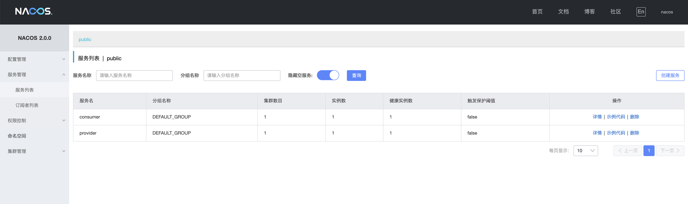
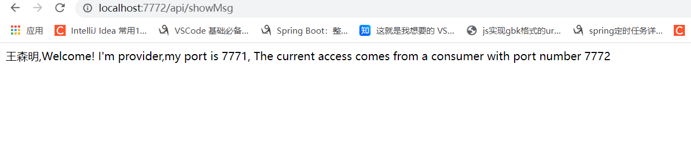

## 使用nacos作为注册中心和配置中心

* 什么是Nacos?

> Nacos 致力于帮助您发现、配置和管理微服务。Nacos 提供了一组简单易用的特性集，帮助您快速实现动态服务发现、服务配置、服务元数据及流量管理。 是Spring Cloud A 中的服务注册发现组件，类似于Consul、Eureka，同时它又提供了分布式配置中心的功能，这点和Consul的config类似，支持热加载。

* Nacos下载和启动

> Nacos依赖于Java环境，所以必须安装Java环境。然后从官网下载Nacos的解压包，安装稳定版的，下载地址：
>
> https://github.com/alibaba/nacos/releases

> 下载完成后，解压，在解压后的文件的/bin目录下，windows系统点击startup.cmd就可以启动nacos。linux或mac执行以下命令启动nacos。
> startup.cmd -m standalone
>
> sh startup.sh -m standalone

> 启动时会在控制台，打印相关的日志。nacos的启动端口为8848,在启动时要保证端口不被占用。珠穆拉马峰的高度是8844，nacos的端口是8848，有点巧合。

> 启动成功，在浏览器上访问：http://localhost:8848/nacos，会跳转到登陆界面，默认的登陆用户名为nacos，密码也为nacos。


### 项目

* 项目结构
  

* 父pom.xml 中映主要引入

```xml

<properties>
    <java.version>1.8</java.version>
    <spring-boot.version>2.4.4</spring-boot.version>
    <spring-cloud.version>2020.0.2</spring-cloud.version>
    <spring-cloud-alibaba.version>2020.0.RC1</spring-cloud-alibaba.version>
</properties>

<dependencyManagement>
<dependencies>
    <!-- spring boot 依赖 -->
    <dependency>
        <groupId>org.springframework.boot</groupId>
        <artifactId>spring-boot-dependencies</artifactId>
        <version>${spring-boot.version}</version>
        <type>pom</type>
        <scope>import</scope>
    </dependency>
    <!-- spring cloud 依赖 -->
    <dependency>
        <groupId>org.springframework.cloud</groupId>
        <artifactId>spring-cloud-dependencies</artifactId>
        <version>${spring-cloud.version}</version>
        <type>pom</type>
        <scope>import</scope>
    </dependency>
    <!-- spring cloud alibaba 依赖 -->
    <dependency>
        <groupId>com.alibaba.cloud</groupId>
        <artifactId>spring-cloud-alibaba-dependencies</artifactId>
        <version>${spring-cloud-alibaba.version}</version>
        <type>pom</type>
        <scope>import</scope>
    </dependency>
</dependencies>
</dependencyManagement>

```

* 服务提供者provider

1. 在provider的pom文件引入依赖

```xml

<dependencies>
    <dependency>
        <groupId>org.springframework.boot</groupId>
        <artifactId>spring-boot-starter-web</artifactId>
    </dependency>

    <dependency>
        <groupId>com.alibaba.cloud</groupId>
        <artifactId>spring-cloud-starter-alibaba-nacos-discovery</artifactId>
    </dependency>

    <dependency>
        <groupId>org.springframework.boot</groupId>
        <artifactId>spring-boot-starter-test</artifactId>
        <scope>test</scope>
    </dependency>
</dependencies>
```

2. 配置文件application.yml

```yml
  server:
    port: 7771

  spring:
    application:
      name: provider
    cloud:
      nacos:
        discovery:
          server-addr: 127.0.0.1:8848
```

3. 启动类

> 添加 @EnableDiscoveryClient
>
> @EnableDiscoveryClient和@EnableEurekaClient共同点就是：都是能够让注册中心能够发现，扫描到改服务。

4. 写一个接口

```java
import org.springframework.beans.factory.annotation.Value;
import org.springframework.web.bind.annotation.GetMapping;
import org.springframework.web.bind.annotation.RequestMapping;
import org.springframework.web.bind.annotation.RequestParam;
import org.springframework.web.bind.annotation.RestController;

/**
 * <p></p>
 * <p></p>
 *
 * @author 王森明
 * @date 2021/11/1 13:04
 * @since 1.0.0
 */
@RequestMapping("service")
@RestController
public class ProviderController {
  @Value("${server.port}")
  private String serverPort;

  @GetMapping("/getMsg")
  public String getMsg(@RequestParam(value="name",required = false,defaultValue = "王森明")String name){
    return  name+",Welcome! I'm provider,my port is "+serverPort;
  }
}

```

* 服务消费者consumer

1. 在pom文件引入以下依赖

```xml

<dependencies>
    <!--必须引入starter-web才能注册到nacos中去-->
    <dependency>
        <groupId>org.springframework.boot</groupId>
        <artifactId>spring-boot-starter-web</artifactId>
    </dependency>

    <dependency>
        <groupId>com.alibaba.cloud</groupId>
        <artifactId>spring-cloud-starter-alibaba-nacos-discovery</artifactId>
    </dependency>

    <!--需要注意的是引入openfeign，必须要引入loadbalancer，否则无法启动。-->
    <dependency>
        <groupId>org.springframework.cloud</groupId>
        <artifactId>spring-cloud-starter-openfeign</artifactId>
    </dependency>
    <dependency>
        <groupId>org.springframework.cloud</groupId>
        <artifactId>spring-cloud-starter-loadbalancer</artifactId>
    </dependency>

    <dependency>
        <groupId>org.springframework.boot</groupId>
        <artifactId>spring-boot-starter-test</artifactId>
        <scope>test</scope>
    </dependency>
</dependencies>
```

2. 配置文件application.yml

```yml

server:
  port: 7772

spring:
  application:
    name: consumer

  cloud:
    nacos:
      discovery:
        server-addr: 127.0.0.1:8848
```

3. 启动类

```java
import org.springframework.boot.SpringApplication;
import org.springframework.boot.autoconfigure.SpringBootApplication;
import org.springframework.cloud.client.discovery.EnableDiscoveryClient;
import org.springframework.cloud.openfeign.EnableFeignClients;

/**  在工程的启动文件开启FeignClient的功能 */
@EnableFeignClients
/** @EnableDiscoveryClient和@EnableEurekaClient共同点就是：都是能够让注册中心能够发现，扫描到改服务。 */
@EnableDiscoveryClient
@SpringBootApplication
public class ConsumerApplication {

    public static void main(String[] args) {
        SpringApplication.run(ConsumerApplication.class, args);
    }

}
```

4. 写一个FeignClient，去调用provider服务的接口

```java
import org.springframework.cloud.openfeign.FeignClient;
import org.springframework.web.bind.annotation.GetMapping;
import org.springframework.web.bind.annotation.RequestParam;

/**
 * <p>写一个FeignClient，去调用provider服务的接口：</p>
 * <p></p>
 *
 * @author 王森明
 * @date 2021/11/1 13:14
 * @since 1.0.0
 */
@FeignClient(value = "provider")
public interface ProviderFeignClient {
  /**
   * /provider/getMsg  这里的路径等于  provider 端 对应接口的全地址  http://localhost:7771/provider/getMsg?name=wangsm
   * @param name
   * @return
   */
  @GetMapping("/service/getMsg")
  String getMsg(@RequestParam(value="name",required = false) String name);
}

```

5. 写一个接口，让consumer去调用provider服务的接口

```java
import com.wxm.consumer.feign.ProviderFeignClient;
import org.springframework.beans.factory.annotation.Autowired;
import org.springframework.beans.factory.annotation.Value;
import org.springframework.web.bind.annotation.GetMapping;
import org.springframework.web.bind.annotation.RequestMapping;
import org.springframework.web.bind.annotation.RequestParam;
import org.springframework.web.bind.annotation.RestController;

/**
 * <p>写一个contro 调用对应feign client  接口中的方法</p>
 * <p></p>
 *
 * @author 王森明
 * @date 2021/11/1 13:17
 * @since 1.0.0
 */
@RequestMapping("api")
@RestController
public class ConsumerController {
  @Value("${server.port}")
  private String serverPort;
  @Autowired
  private ProviderFeignClient providerFeignClient;

  @GetMapping("/showMsg")
  private String getMsg(@RequestParam(value="name",required = false) String name){
    return providerFeignClient.getMsg(name)+", The current access comes from a consumer with port number "+serverPort;
  }
}

```

* 启动两个工程，在nacos页面查看，可见2个服务都已经注册成功

  

* 服务调用
在浏览器上输入 [http://localhost:7772/api/showMsg](http://localhost:7772/api/showMsg) ，浏览器返回响应：

  可见浏览器的请求成功调用了consumer服务的接口，consumer服务也成功地通过feign成功的调用了provider服务的接口。
  
* 使用sc loadbanlancer作为负载均衡
> 其实feign使用了spring cloud loadbanlancer作为负载均衡器。
可以通过修改provider的端口，再在本地启动一个新的provider服务，那么本地有2个provider 服务，端口分别为8761 和8762。在浏览器上多次调用http://localhost:8763/hi-feign，浏览器会交替显示：
 