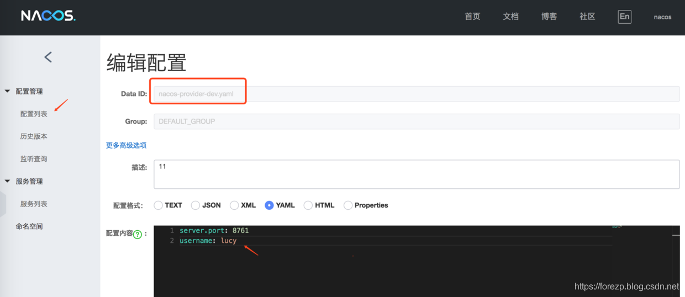

## nacos 作为配置中心

> Nacos除了可以作为服务注册中心，它还有服务配置中心的功能。类似于consul config，Nacos 是支持热加载的。本篇文章将讲述如何使用Nacos作为配置中心。

> 在（Nacos作为服务注册与发现）的provider工程上改造的， 在工程的pom文件引入nacos-config的Spring cloud依赖，版本为0.9.0. RELEASE，代码如下：

```xml
    <dependencies>
    <dependency>
        <groupId>org.springframework.boot</groupId>
        <artifactId>spring-boot-starter-web</artifactId>
    </dependency>

    <dependency>
        <groupId>com.alibaba.cloud</groupId>
        <artifactId>spring-cloud-starter-alibaba-nacos-discovery</artifactId>
    </dependency>

    <dependency>
        <groupId>org.springframework.cloud</groupId>
        <artifactId>spring-cloud-alibaba-nacos-config</artifactId>
        <version>0.9.0.RELEASE</version>
    </dependency>

    <dependency>
        <groupId>org.springframework.cloud</groupId>
        <artifactId>spring-cloud-starter-bootstrap</artifactId>
        <version>3.0.1</version>
    </dependency>

    <dependency>
        <groupId>org.springframework.boot</groupId>
        <artifactId>spring-boot-starter-test</artifactId>
        <scope>test</scope>
    </dependency>
</dependencies>
```
* 在bootstrap.yml(一定是bootstrap.yml文件，不是application.yml文件)文件配置以下内容：
```yml
#server:
 # port: 9999  端口也可以配置再nacos中

spring:
  application:
    name: provider-config
  cloud:
    nacos:
      discovery:  # 注册和发现中心
        server-addr: 127.0.0.1:8848


      config:  #配置中心
        server-addr: 127.0.0.1:8848
        file-extension: yaml
        prefix: provider-config

  profiles:
    active: dev


   # 在上面的配置中，配置了nacos config server的地址，配置的扩展名是ymal（目前仅支持ymal和properties）。注意是没有配置server.port的，sever.port的属性在nacos中配置。上面的配置是和Nacos中的dataId 的格式是对应的，nacos的完整格式如下：

    #${prefix}-${spring.profile.active}.${file-extension}

   # prefix 默认为 spring.application.name 的值，也可以通过配置项 spring.cloud.nacos.config.prefix来配置。
    #spring.profile.active 即为当前环境对应的 profile，详情可以参考 Spring Boot文档。 注意：当 spring.profile.active 为空时，对应的连接符 - 也将不存在，dataId 的拼接格式变成 ${prefix}.${file-extension}
    #file-exetension 为配置内容的数据格式，可以通过配置项 spring.cloud.nacos.config.file-extension 来配置。目前只支持 properties 和 yaml 类型。

```

* nacos 中配置

  
* 启动类添加 @EnableDiscoveryClient
```java
@EnableDiscoveryClient
@SpringBootApplication
public class ProviderConfigApplication {

    public static void main(String[] args) {
        SpringApplication.run(ProviderConfigApplication.class, args);
    }

}

```
  
* 写一个RestController,在Controller上添加 @RefreshScope 实现配置的热加载。代码如下：
```java
 import org.springframework.beans.factory.annotation.Value;
import org.springframework.cloud.context.config.annotation.RefreshScope;
import org.springframework.web.bind.annotation.GetMapping;
import org.springframework.web.bind.annotation.RequestMapping;
import org.springframework.web.bind.annotation.RequestParam;
import org.springframework.web.bind.annotation.RestController;

/**
 * <p></p>
 * <p></p>
 *
 * @author 王森明
 * @date 2022/1/28 13:22
 * @since 1.0.0
 */
@RestController
@RequestMapping("/config")
@RefreshScope  //写一个RestController,在Controller上添加 @RefreshScope 实现配置的热加载
public class ProviderConfigController {
    @Value(value="${server.port}")
    private String serverPort;

    @GetMapping("/getMsg")
    public String getMsg(@RequestParam(value="name",required = false,defaultValue = "王森明")String name){
        return  name+",Welcome! I'm provider,my port is "+serverPort;
    }


    @Value("${name}")
    private String name;
    @GetMapping("/getName")
    public String getName(){
        return "name is :"+name+",Welcome! I'm provider,my port is "+serverPort;
    }
}

```

> 启动工程nacos-provider，在浏览器上访问localhost:8761/username，可以返回在nacos控制台上配置的username。在nacos 网页上更改username的配置，在不重启nacos-provider工程的情况下，重新访问localhost:8761/username，返回的事修改后的值，可见nacos作为配置中心实现了热加载功能。
 